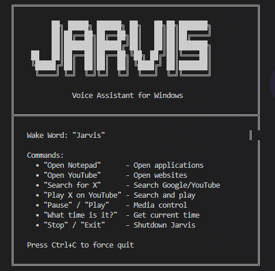

### A Python Voice AssistaNT CLI

[](https://www.python.org/downloads/)
[](https://opensource.org/licenses/MIT)

A Python-based voice assistant with a graphical user interface. Jarvis listens for your voice commands to perform various tasks on your desktop, from launching applications to searching the web.

---

## 🖼️ GUI Overview



---

## ✨ Features

- **Voice-Activated:** Control the assistant entirely with your voice, starting with the wake word "Jarvis".
- **GUI Interface:** A clean, modern interface with an animated orb provides visual feedback on the assistant's state (Idle, Listening, Speaking).
- **Application Control:** Launch installed applications like Notepad, Calculator, Chrome, etc.
- **Web Control:** Open popular websites like YouTube, Google, and GitHub.
- **Web Search:** Search Google or YouTube for any query.
- **Media Playback:** Ask Jarvis to play music or videos on YouTube.
- **System Commands:** Control media (play/pause), get the current time, and shut down the assistant.
- **Modular & Extensible:** Built with a clear separation between the GUI, STT/TTS engines, and command handling, making it easy to add new abilities.

---

## 🛠️ Installation & Setup

Follow these steps to get Jarvis up and running on your local machine.

### 1. Clone the Repository
```bash
git clone <repository_url>
cd Voice_Bot
```

### 2. Install Dependencies
It's recommended to use a Python virtual environment.
```bash
# Create a virtual environment
python -m venv .venv

# Activate it
# On Windows
.venv\Scripts\activate
# On macOS/Linux
source .venv/bin/activate

# Install the required packages
pip install -r requirements.txt
```

### 3. Download the Speech Recognition Model
The assistant requires a Vosk speech model to function. The recommended model offers a good balance between performance and accuracy.

- **Download the model:** [vosk-model-en-us-0.22-lgraph (128MB)](https://alphacephei.com/vosk/models/vosk-model-en-us-0.22-lgraph.zip)
- **Extract** the downloaded `.zip` file.
- **Move** the resulting folder (e.g., `vosk-model-en-us-0.22-lgraph`) into the `models` directory in the project root.

The code is pre-configured to use this specific model.

### 4. Run the Application
Once the setup is complete, you can start the assistant:
```bash
python main.py
```
A GUI window with the animated orb will appear, and Jarvis will be ready to listen for the wake word.

---

## 🚀 Usage

1.  **Wake Word:** Start any command by saying "**Jarvis**". The orb in the GUI will change color to indicate it's listening.
2.  **Speak Your Command:** After saying the wake word, speak your command clearly. You can either say the wake word and command together (e.g., "Jarvis, open notepad") or say the wake word, pause, and then say the command.

#### Example Commands
- "Jarvis, open notepad"
- "Jarvis, open youtube"
- "Jarvis, what time is it?"
- "Jarvis, search for lofi music on youtube"
- "Jarvis, play the latest movie trailers"
- "Jarvis, goodbye"
